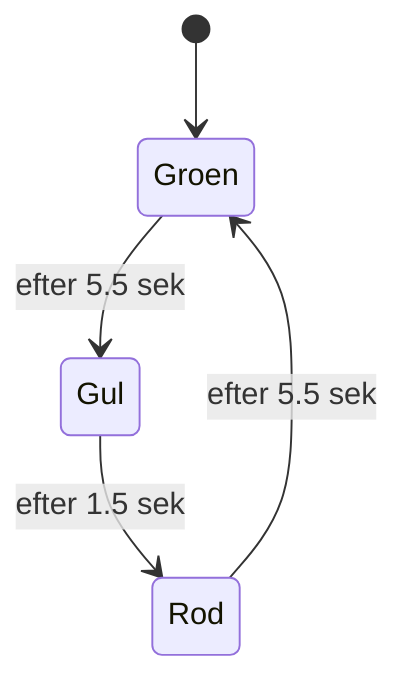
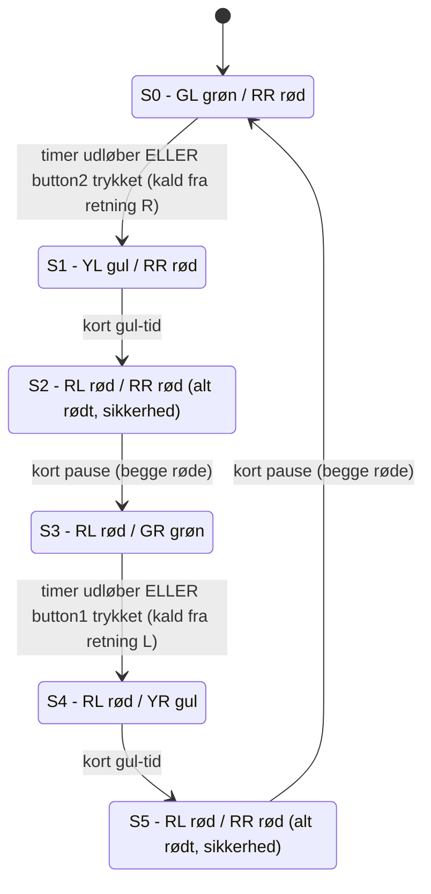
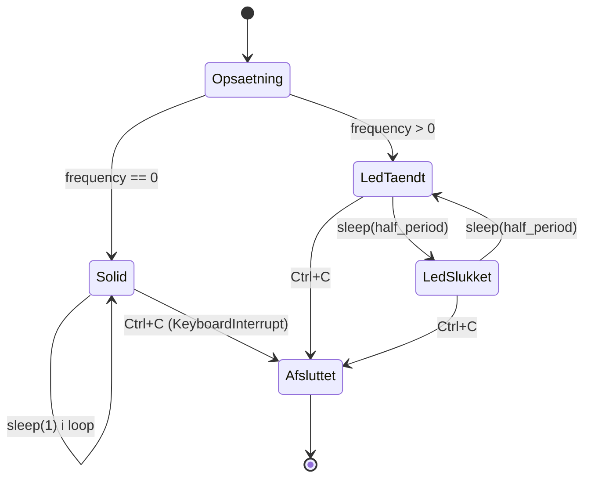

# Statemachines – Eksamensnoter (Embedded / Pico)

Baseret på **Statemachine_v2.pptx**, **Lyskryds.pptx**, **PWM.pptx** og jeres egen kode.

En statemachine er en cirkel-baseret model: hver cirkel = en **state** (en funktion/tilstand),
og hver pil = en **transition** (betingelse/timer der får den til at skifte til næste state).
Det klassiske mønster fra slides er:

```python
def state0():
    ...             # gør noget
    return state1   # næste state

state = state0
while state:
    state = state()
```

---

## 1. Simpelt trafiklys (ét lys) – fra Statemachine_v2 slide 9

Det eksempel I fik udleveret i slides (grøn/gul/rød med `sleep`):



| State  | Funktion  | Varighed | LED tændt |
|--------|-----------|----------|-----------|
| state0 | Grøn, kør | 5.5 s    | Grøn      |
| state1 | Gul, stop | 1.5 s    | Gul       |
| state2 | Rød, stop | 5.5 s    | Rød       |

Ren **cyklisk** FSM, ingen input – kun tid styrer overgangene. Det er byggestenen for det rigtige lyskryds.

---

## 2. Lyskryds (fuldt kryds) – matcher jeres pin-opsætning

```python
button1 = Pin(6, Pin.IN, Pin.PULL_UP)
button2 = Pin(7, Pin.IN, Pin.PULL_UP)
ledRL, ledYL, ledGL = ...   # "Left" lys  (fx Nord-Syd)
ledRR, ledYR, ledGR = ...   # "Right" lys (fx Øst-Vest)
```

Et kryds er to af de simple trafiklys ovenfor, koblet sammen så de **aldrig er grønne samtidig**
(og gerne med et kort "alt-rødt" sikkerhedsvindue, ligesom i slides om lyskrydset delt i 2 dele).



**Sådan læses tabellen som LED-tilstande i koden:**

| State | ledGL | ledYL | ledRL | ledGR | ledYR | ledRR | Kommentar |
|-------|:-----:|:-----:|:-----:|:-----:|:-----:|:-----:|-----------|
| S0    | 1     | 0     | 0     | 0     | 0     | 1     | Left grøn, Right rød |
| S1    | 0     | 1     | 0     | 0     | 0     | 1     | Left gul (om at stoppe) |
| S2    | 0     | 0     | 1     | 0     | 0     | 1     | Alt rødt (sikkerhedspause) |
| S3    | 0     | 0     | 1     | 1     | 0     | 0     | Right grøn, Left rød |
| S4    | 0     | 0     | 1     | 0     | 1     | 0     | Right gul |
| S5    | 0     | 0     | 1     | 0     | 0     | 1     | Alt rødt (sikkerhedspause) |

**Om knapperne:** `button1`/`button2` er sat op med `PULL_UP`, dvs. de læses som `0` når de er
trykket ned (aktiv-lav). En naturlig brug (svarende til fodgænger-/kaldeknap i slides) er at
lade en knap **afkorte den igangværende grønne fase** for den modsatte retning, i stedet for at
vente på fuld timer – men selve logikken for det er ikke med i jeres uddrag, så tjek jeres eget
kode/opgavetekst for præcis brug af knapperne, da det kan være defineret anderledes hos jer
(fx bare til manuelt at skifte state ét skridt ad gangen under test).

---

## 3. PWM LED – lysstyrke + blink, fra jeres egen kode



| State        | Hvad sker der | Betingelse for at forlade |
|--------------|---------------|----------------------------|
| Opsætning    | Spørger om frekvens (0–20 Hz) og lysstyrke (0–100 %), beregner `duty` | Med det samme |
| Solid        | LED'er sat til fast `duty` (evt. 0 = slukket) | Kun `Ctrl+C` |
| LED tændt    | `duty` sat på begge PWM-udgange | Efter `half_period` sekunder |
| LED slukket  | `duty_u16(0)` på begge | Efter `half_period` sekunder |
| Afsluttet    | Duty=0, `deinit()` af begge PWM, print besked | – (slut) |

Bemærk: `half_period = (1/frequency)/2` — det er derfor state-maskinen kun har to
skiftende states (tændt/slukket), der ping-ponger med lige lange pauser, mens "brightness"
(duty) er en **parameter** sat én gang i opsætningen, ikke en selvstændig state.

---

## Andre statemachine-eksempler fra slides (til den mundtlige del)

- **Elevator**: states = fx `Idle`, `KørerOp`, `KørerNed`, `DørÅben`, styret af hvilken etage der er kaldt fra og nuværende position.
- **Random machine**: en state kan tilfældigt (`random()`) vælge næste state i stedet for en fast rækkefølge — bruges til at vise at "next state" ikke behøver være deterministisk.
- **Hysterese-sløjfe** (fx termostat): kun 2 states, `on`/`off`, men med to forskellige tærskler (23° tænder, 25° slukker) så den ikke "flimrer" omkring én temperatur.

Fælles pointe til eksamen: **en state = en funktion der gør ét stykke arbejde og returnerer hvilken funktion der er næste state** — uanset om skiftet styres af tid (`sleep`), en knap, en sensorværdi, eller tilfældighed.
