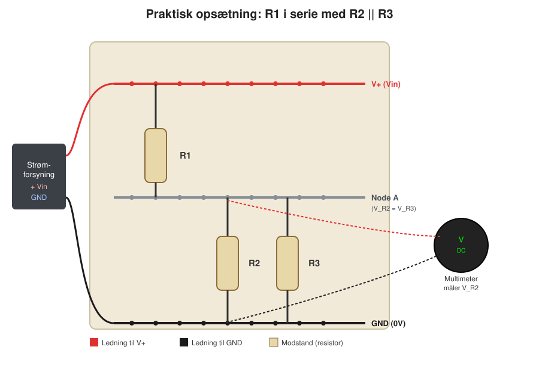
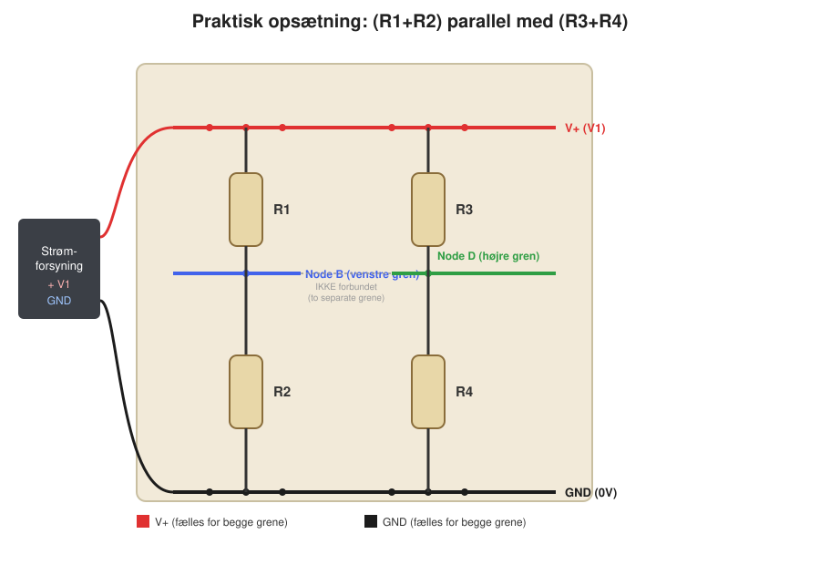

# Klassiske resistor-netværk: Serie- og parallelkombinationer

En pædagogisk gennemgang af de to kredsløb fra tavlen — hvordan man analyserer dem teoretisk, og hvordan man bygger dem i virkeligheden.

---

## 1. Grundprincipperne, du skal huske

Før vi går løs på kredsløbene, tre grundregler du bruger igen og igen:

| Regel | Serieforbindelse | Parallelforbindelse |
|---|---|---|
| **Strøm** | Samme strøm gennem alle komponenter | Strømmen deler sig op |
| **Spænding** | Spændingen deler sig op | Samme spænding over alle komponenter |
| **Modstand** | $R_{tot} = R_1 + R_2 + \dots$ | $\dfrac{1}{R_{tot}} = \dfrac{1}{R_1}+\dfrac{1}{R_2}+\dots$ (for to modstande: $R_1 \parallel R_2 = \dfrac{R_1 R_2}{R_1+R_2}$) |

Og selvfølgelig **Ohms lov**, som er limen i det hele:
$$V = I \cdot R \quad\Leftrightarrow\quad I = \frac{V}{R} \quad\Leftrightarrow\quad R = \frac{V}{I}$$

**Metoden** til at løse ethvert resistor-netværk er altid den samme tre-trins-opskrift:

1. **Reducér** kredsløbet trin for trin til én ækvivalent modstand ($R_T$).
2. **Find totalstrømmen** ud fra kilden med Ohms lov: $I_T = V_{in}/R_T$.
3. **"Gå baglæns"** gennem reduktionerne og find spænding og strøm for hver enkelt modstand.

---

## 2. Kredsløb 1: R1 i serie med (R2 parallel R3)

### Opbygning
Spændingskilden $V_{in}$ sender strøm gennem R1. Efter R1 forgrener strømmen sig ud i to parallelle grene: R2 og R3, som begge går tilbage til minus-polen.

```
        Vin
         │
        R1
         │
   ┌─────┼─────┐
   │     A     │
  R2           R3
   │           │
   └─────┬─────┘
        GND
```

### Trin 1 — Reducér R2 og R3 til én modstand
R2 og R3 sidder parallelt (de har begge det ene ben i knudepunkt A og det andet ben i GND), så de kan slås sammen:

$$R_{23} = R_2 \parallel R_3 = \frac{R_2 \cdot R_3}{R_2+R_3}$$

Nu ser kredsløbet ud, som om det bare er R1 i serie med én modstand $R_{23}$:

$$R_T = R_1 + R_{23} = R_1 + (R_2 \parallel R_3)$$

### Trin 2 — Find totalstrømmen
Da hele kredsløbet nu er reduceret til én modstand, giver Ohms lov straks totalstrømmen — den strøm der løber ud af kilden og gennem R1:

$$I_T = \frac{V_{in}}{R_T} = \frac{V_{in}}{R_1 + (R_2\parallel R_3)}$$

### Trin 3 — Gå baglæns: find de enkelte spændinger
Spændingsfaldet over R1 (Ohms lov, da vi kender $I_T$ og $R_1$):

$$V_{R_1} = I_T \cdot R_1$$

Spændingen over R2 og R3 er **ens**, fordi de er parallelle. Den kan findes på to ækvivalente måder:

$$V_{R_2} = V_{R_3} = I_T \cdot R_{23}$$

eller (simplere at huske): kildespændingen deler sig mellem R1 og "resten", så det der er tilbage efter R1, er det R2/R3 får:

$$V_{R_2} = V_{R_3} = V_{in} - V_{R_1}$$

### Trin 4 — Find de enkelte strømme (strømdeling)
Nu hvor vi kender spændingen over R2 og R3, giver Ohms lov strømmen i hver gren for sig:

$$I_{R_2} = \frac{V_{R_2}}{R_2} \qquad I_{R_3} = \frac{V_{R_3}}{R_3}$$

**Tjek dit arbejde:** $I_{R_2} + I_{R_3}$ skal give præcis $I_T$ igen (strøm der går ind i et knudepunkt = strøm der går ud — Kirchhoffs strømlov).

---

## 3. Kredsløb 2: (R1+R2) parallel med (R3+R4)

### Opbygning
Her er princippet spejlvendt: to **serie-grene** sidder parallelt med hinanden hen over kilden $V_1$.

- Venstre gren: R1 i serie med R2
- Højre gren: R3 i serie med R4
- Begge grene ligger mellem samme to punkter: V+ og GND

```
        V1
   ┌────┼────┐
   │         │
  R1        R3
   │         │
   B         D
   │         │
  R2        R4
   │         │
   └────┬────┘
       GND
```

### Trin 1 — Reducér hver gren for sig, derefter parallelt
Inden i hver gren er komponenterne i **serie**, så de lægges bare sammen:

$$R_{12} = R_1 + R_2 \qquad R_{34} = R_3 + R_4$$

De to grene sidder **parallelt** med hinanden (samme spænding $V_1$ over begge), så det endelige udtryk bliver:

$$R_T = (R_1+R_2)\parallel(R_3+R_4)$$

Tavlen viser netop denne trinvise reduktion visuelt: først samles hver gren til én modstand, derefter samles de to grene til én.

### Trin 2 — Find grenstrømmene direkte
Fordi begge grene ligger direkte over kildespændingen $V_1$, kan man springe "find $I_T$ først"-trinnet over og regne strømmen i hver gren direkte med Ohms lov:

$$I_{R_1} = I_{R_2} = \frac{V_1}{R_1+R_2}$$

$$I_{R_3} = I_{R_4} = \frac{V_1}{R_3+R_4}$$

Bemærk: fordi R1 og R2 er i serie, er strømmen **den samme** gennem begge — ligeledes for R3 og R4 i den anden gren. (Vil du kende den samlede strøm fra kilden, er det bare $I_T = I_{R_1}+I_{R_3}$.)

### Trin 3 — Find spændingsfaldene i hver gren
Nu hvor grenstrømmene er kendt, giver Ohms lov spændingen over hver enkelt modstand:

$$V_{R_1} = I_{R_1}\cdot R_1 \qquad V_{R_2} = I_{R_1}\cdot R_2$$

$$V_{R_3} = I_{R_3}\cdot R_3 \qquad V_{R_4} = I_{R_3}\cdot R_4$$

**Tjek dit arbejde:** $V_{R_1}+V_{R_2} = V_1$ og $V_{R_3}+V_{R_4}=V_1$, fordi hver gren tilsammen skal "bruge" hele kildespændingen (Kirchhoffs spændingslov).

---

## 4. De to kredsløb side om side

| | Kredsløb 1: R1 + (R2‖R3) | Kredsløb 2: (R1+R2) ‖ (R3+R4) |
|---|---|---|
| Struktur | Én modstand i serie, to i parallel | To serie-grene, som er parallelle med hinanden |
| Hvad er ens? | Strømmen gennem R1 = $I_T$; spændingen over R2 og R3 | Spændingen over hver gren = $V_1$; strømmen i hver gren er konstant internt |
| Første reduktionstrin | Slå R2 og R3 sammen ($\parallel$) | Slå R1+R2 sammen og R3+R4 sammen (serie) |
| Andet reduktionstrin | Læg R1 og $R_{23}$ sammen (serie) | Slå de to grene sammen ($\parallel$) |

Den underliggende pointe er den samme i begge tilfælde: **du reducerer kredsløbet, indtil det er én modstand, regner totalstrømmen (eller grenspændingen), og bagudregner dig derfra til alle detaljer.**

---

## 5. Sådan sætter du det op i virkeligheden

I praksis bygger man typisk sådan et kredsløb på et **breadboard** (prototypebræt) med en justerbar strømforsyning og et multimeter til at verificere dine beregninger.

**Vigtige praktiske pointer:**

- **Strømforsyningens plus-pol** forbindes med en ledning til breadboardets ene strømskinne (typisk den røde/+ skinne).
- **Strømforsyningens minus-pol (GND)** forbindes til den anden strømskinne (den sorte/blå skinne).
- Modstandenes ben sættes i breadboardets huller, som er elektrisk forbundet i grupper på 5 (samme "række"). Det er *præcis* det, der fysisk skaber dine "knudepunkter" (Node A, Node B osv.) — alle ben, der sidder i samme rækkegruppe, er automatisk elektrisk forbundet.
- Et **multimeter** (indstillet til DC volt) sættes parallelt over den modstand, du vil måle spændingen på — sort probe mod GND-siden, rød probe mod plus-siden af modstanden. Vil du måle **strøm**, skal multimeteret derimod klippes ind i selve ledningen (i serie).

### Diagram: Kredsløb 1 på breadboard


Her ses det tydeligt: R1 forbinder V+-skinnen med "Node A"-rækken. R2 og R3 sidder begge med det ene ben i Node A-rækken og det andet ben i GND-skinnen — det er derfor, de er parallelle: de deler bogstaveligt talt de samme to elektriske knudepunkter.

### Diagram: Kredsløb 2 på breadboard


Her ses de to grene tydeligt adskilt: venstre gren (R1→Node B→R2) og højre gren (R3→Node D→R4) deler kun V+ og GND-skinnerne med hinanden — de to midterste noder (B og D) er **ikke** forbundet til hinanden, hvilket er præcis grunden til, at de to grene regnes uafhængigt af hinanden, før de til sidst samles parallelt.

---

## 6. Praktisk tjekliste, når du bygger og måler

1. Byg kredsløbet, og **beregn** alle spændinger og strømme på papir først (som ovenfor).
2. Sæt strømforsyningen til den ønskede $V_{in}$/$V_1$, men **tænd den ikke**, før alle forbindelser er på plads.
3. Mål spændingen over hver modstand med multimeteret, og sammenlign med dine beregnede værdier.
4. Hvis noget ikke stemmer: tjek at modstandenes ben faktisk sidder i den rækkegruppe, du tror (et løst ben er den klassiske fejlkilde på breadboards).
5. Brug Kirchhoffs love som "facit-tjek": strømme ind i et knudepunkt = strømme ud, og spændingsfald rundt i en løkke = 0.

---

*Tip: Vil du øve dig, så prøv at sætte konkrete tal ind (fx $V_{in}=12V$, $R_1=1k\Omega$, $R_2=2k\Omega$, $R_3=2k\Omega$) og regn hele vejen igennem — så kan du bagefter bygge det og se, om multimeteret er enig med dig.*
